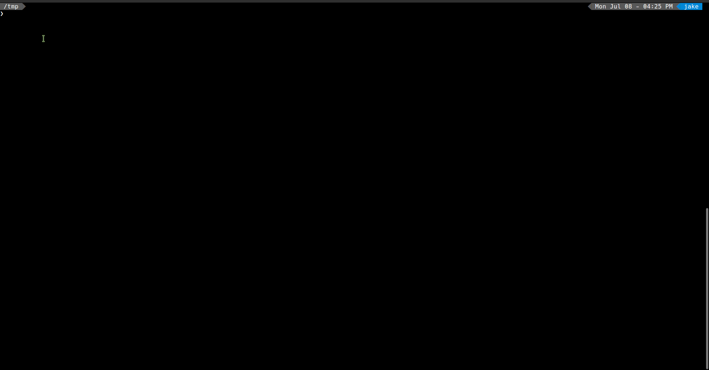

# firstiep
[](https://godoc.org/github.com/jakewarren/firstiep)
[](https://github.com/jakewarren/firstiep/blob/master/LICENSE)
[](https://goreportcard.com/report/github.com/jakewarren/firstiep)
[](http://makeapullrequest.com)

> Tools for working with FIRST IEP (Information Exchange Policy) objects

## Demo


## Install

```
go get github.com/jakewarren/firstiep/...
```

## Usage
### As a library

```go
package main

import (
	"fmt"

	"github.com/jakewarren/firstiep"
)

func main() {

	i := firstiep.New()
	i.TLP = "RED"

	fmt.Println(i)

	// perform validation on the object
	isValid := i.Validate()
	if isValid == nil {
		fmt.Println("Valid!")
	} else {
		fmt.Println("Not valid:", isValid)
	}

}
```

### As a cmd line utility

On the command line, run `firstiep` and follow the wizard to select the options you want, the tool will then output the JSON representation.
